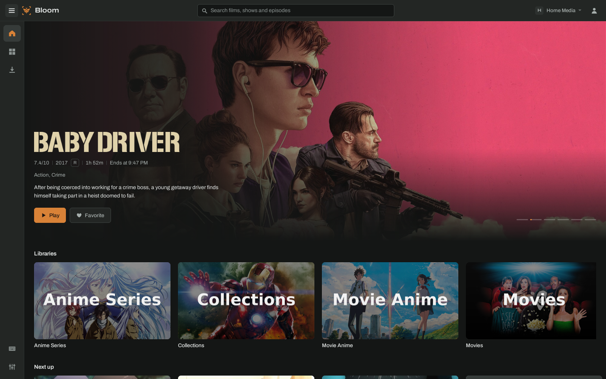
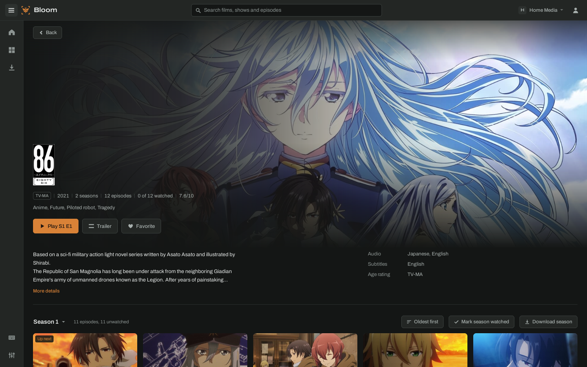
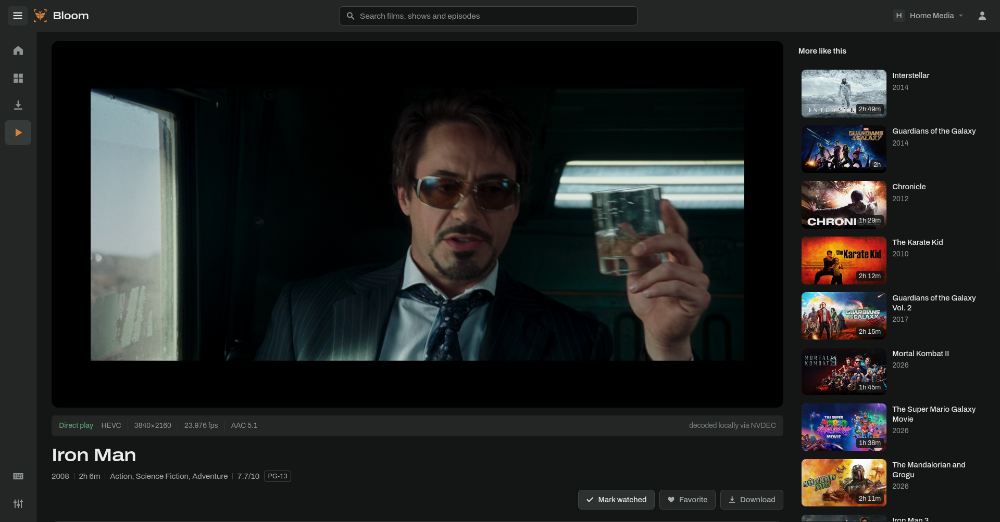

<p align="center">
  
</p>

<h1 align="center">Bloom</h1>

<p align="center">A fast desktop client for <a href="https://jellyfin.org">Jellyfin</a>, for Linux.</p>

<p align="center">
  
</p>
<p align="center">
  
</p>
<p align="center">
  
</p>

Bloom plays your films and shows from a Jellyfin server in a native window, decoding video on your GPU,
with the polish of a streaming app. It's built with Tauri, Svelte and mpv.

> **Pre-release.** Bloom is a personal project in its first public release. It works day to day,
> but expect rough edges. Bug reports are very welcome; replies may take a while.

Bloom is not affiliated with or endorsed by the Jellyfin project.

## Features

- **Playback through mpv**, decoded on the GPU: NVDEC on NVIDIA, VA-API on Intel and AMD, with
  software as the fallback. Direct play whenever the file allows, the server's transcoding
  otherwise, with a quality menu.
- **A full player:** chapters, skip intro and credits, audio and subtitle tracks remembered per
  show, subtitle size and style, playback speed, up next, theater mode and full screen.
- **Browsing:** Home with a spotlight, Continue Watching and Next Up; libraries, series, films,
  collections and trailers; search with suggestions.
- **Downloads** of films, episodes and whole seasons, playable with no server.
- **Stays in sync** with the server as things change: watched state, favourites, new titles.
- **Several servers and accounts**, with servers on your network found automatically.
- **Extras:** a command palette (<kbd>Ctrl</kbd>+<kbd>K</kbd>), custom themes, Discord presence
  and desktop notifications for new episodes (both off until you turn them on).

**Documentation:** [getting started](docs/getting-started.md) · [watching](docs/watching.md) ·
[downloads](docs/downloads.md) · [settings](docs/settings.md) · [custom themes](docs/themes.md) ·
[troubleshooting and FAQ](docs/troubleshooting.md)

## Install

Download `Bloom_0.1.0_amd64.AppImage` from the [releases](../../releases), then:

```sh
chmod +x Bloom_0.1.0_amd64.AppImage
./Bloom_0.1.0_amd64.AppImage
```

**Requirements**

- 64-bit x86 Linux with glibc 2.39 or newer: Ubuntu 24.04, Debian 13, Fedora 40 or later,
  current Arch, or anything as recent.
- FUSE 2 to run AppImages (`fuse2` on Arch, `libfuse2t64` on Ubuntu, `fuse-libs` on Fedora).
  Without it, run it with `--appimage-extract-and-run`.
- A Jellyfin server (tested with 10.11).
- For GPU decoding on Intel or AMD, your distribution's VA-API driver (`vainfo` should list your
  GPU). NVIDIA needs only its driver.

**Tested on**

| GPU | Decoder | Setup |
|---|---|---|
| NVIDIA RTX 3060 | NVDEC | Arch, KDE Plasma on Wayland |
| Intel Iris Xe (i5-1334U) | VA-API | Arch, KDE Plasma on Wayland |
| AMD Radeon Vega 10 (Ryzen 7 3750H) | VA-API | Arch, KDE Plasma on Wayland |
| NVIDIA GTX 1660 Ti, hybrid laptop | NVDEC | Arch, KDE Plasma on Wayland |

Plus clean Ubuntu 24.04 and Fedora 42 containers. The line under the player says which decoder
is in use.

## Keyboard shortcuts

Press <kbd>?</kbd> in Bloom for the full list. In the player:

| Key | Action |
|---|---|
| <kbd>Space</kbd> / <kbd>K</kbd> | Play or pause |
| <kbd>←</kbd> <kbd>→</kbd> / <kbd>J</kbd> <kbd>L</kbd> | Back or forward 10 seconds |
| <kbd>↑</kbd> <kbd>↓</kbd> | Volume |
| <kbd>M</kbd> | Mute |
| <kbd>C</kbd> | Subtitles on or off |
| <kbd>[</kbd> <kbd>]</kbd> | Previous or next chapter |
| <kbd>S</kbd> | Skip intro or credits |
| <kbd>Shift</kbd>+<kbd>N</kbd> | Next episode |
| <kbd>&lt;</kbd> <kbd>&gt;</kbd> | Slower or faster |
| <kbd>0</kbd>–<kbd>9</kbd> | Jump to 0–90% |
| <kbd>T</kbd> | Theater mode |
| <kbd>F</kbd> | Full screen |
| <kbd>Esc</kbd> | Leave theater mode or full screen |

## Known issues

- **Scrolling the page while a video plays can drop a few frames**, most noticeably on
  integrated graphics. Playback itself stays smooth.
- **Hybrid laptops on Wayland:** `prime-run` alone doesn't move Bloom to the NVIDIA GPU. Add
  `__EGL_VENDOR_LIBRARY_FILENAMES=/usr/share/glvnd/egl_vendor.d/10_nvidia.json` as well.
  Without either, Bloom runs on the integrated GPU, which works fine.
- **Seek-bar thumbnails** appear only when the server has generated trickplay images.
- **No music yet.** Music libraries show, but there's no music player or album downloads.
- **Server discovery** finds servers that answer Jellyfin's UDP broadcast on your local network;
  others need their address typed in.
- Linux and x86_64 only for now.

## Privacy

- Your password is never stored. Bloom keeps the server's sign-in token in a file only your user
  can read.
- No telemetry, analytics or accounts of its own. Bloom talks only to your Jellyfin server, and
  to Discord's app on your computer if you turn presence on.
- Discord presence, when on, shows covers only from public metadata sites (TMDB, AniDB, TheTVDB,
  fanart.tv), never from your server, and can hide the title entirely.

## Building from source

You need Rust, Node.js with npm, libmpv 0.41 or newer with its headers, and WebKitGTK 4.1. On
Arch: `sudo pacman -S --needed base-devel rust nodejs npm mpv webkit2gtk-4.1`.

```sh
cd app
npm install
npm run tauri dev      # run a development build
npm run tauri build    # build release bundles
```

The AppImage is built in an Ubuntu 24.04 container so it runs on older distributions too:
`packaging/build-appimage.sh` (needs Docker), then `packaging/test-appimage.sh` to try it on clean
Ubuntu and Fedora. Tests: `cargo test` in `app/src-tauri`.

[DESIGN.md](DESIGN.md) describes the visual system: colour, type, motion and components.

## Contributing and reporting bugs

See [CONTRIBUTING.md](CONTRIBUTING.md) to help build Bloom. For problems, check
[troubleshooting](docs/troubleshooting.md) first, then use the [bug report form](../../issues/new/choose). It asks for your distribution, GPU,
the decoder line under the player and a log, which make most problems quick to find.

## License

Bloom is free software under the [GNU General Public License v3.0 or later](LICENSE). The AppImage
includes other open-source software under its own licences; see
[THIRD_PARTY_NOTICES.md](THIRD_PARTY_NOTICES.md).
